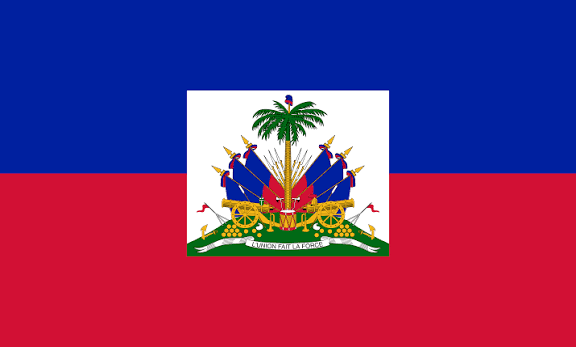

# SAINRISME Marick

## Formation (actuelle)

###  STI2D — spécialité SIN

## Projet professionnel

Après mon **bac STI2D, spécialité SIN**, je souhaite poursuivre mes études en **BTS CIEL (Cybersécurité, Informatique et réseaux, Électronique)** afin de développer mes compétences dans le domaine de l'informatique et des réseaux.

## Compétences

* Informatique
* Systèmes numériques
* Programmation
* Développement de projets
* Travail en équipe

## Logiciels et outils

|                   ProfiLab                  |             Visual Studio Code            |                   Arduino                  |
| :-----------------------------------------: | :---------------------------------------: | :----------------------------------------: |
|  |  |  |

## Langues

| 🇫🇷 Français | 🇭🇹 Créole haïtien | 🇬🇧 Anglais |
|:---:|:---:|:---:|
|  |  |  |

## Centres d'intérêt

* Jeux vidéo
* Basketball
* Musique
